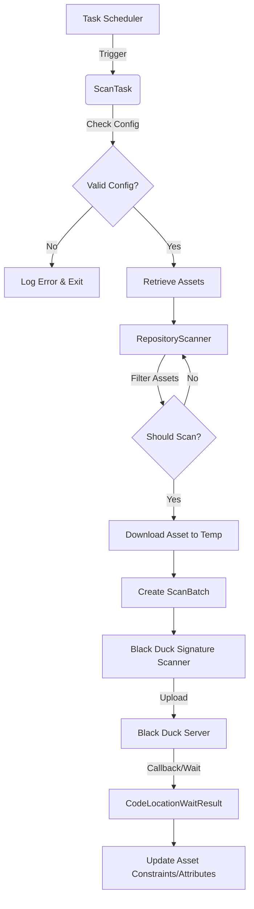

**Date**: 2026-02-19
**Author**: Full-stack Developer & DevSecOps Engineer
---

# Black Duck Nexus 3 Plugin 분석 및 수정 제한 사항 보고서

## 1. 개요 (Overview)

본 보고서는 `blackduck-nexus3` 프로젝트의 전체 구조와 작동 로직을 분석하고, 향후 기능 수정이나 확장 시 발생할 수 있는 제한 사항을 기술합니다. 해당 프로젝트는 Sonatype Nexus Repository Manager 3에 통합되어 저장소 내 아티팩트(Artifact)를 Black Duck 서버와 연동하여 보안 및 라이선스 취약점을 점검하는 플러그인입니다.

### 1.1 기술 스택
- **언어**: Java 8 (Maven Source/Target 1.8)
- **빌드 도구**: Apache Maven
- **프레임워크**:
  - Nexus Repository Manager 3 Plugin API
  - Black Duck Common Library (`blackduck-common`, `blackduck-common-api`)
  - Integration BDIO (`integration-bdio`)
  - OSGi Bundle (Apache Felix)

### 1.2 라이선스 및 저작권 (License & Copyright)
본 프로젝트는 **Apache License 2.0**과 상용 **EULA**가 혼재되어 있어 주의가 필요합니다.

1.  **소스 코드 라이선스 (Apache License 2.0)**
    -   `LICENSE` 파일 및 각 Java 소스 코드 헤더에 **Apache License 2.0**이 명시되어 있습니다.
    -   **권한**: 자유로운 사용, 복제, 배포, **수정(Modification)**이 가능합니다.
    -   **의무**: 수정 시 저작권 고지 유지 및 변경 사항 명시가 필요합니다.

2.  **상용 라이선스 (EULA)**
    -   `EULA.txt` 파일에는 blackduck의 상용 소프트웨어 라이선스 계약이 포함되어 있습니다.
    -   **제약 사항**: 해당 계약 2.2(c)항에 따르면 "Disassemble, decompile, reverse engineer, modify or create derivative works"를 금지하는 조항이 있습니다.
    -   **해석**: GitHub 등을 통해 공개된 소스 코드를 직접 수정하여 사용하는 것은 Apache 2.0에 따라 가능하나, blackduck로부터 **기술 지원(Maintenance Service)**을 받고 있는 경우, 임의 개조된 플러그인은 **지원 대상에서 제외**될 수 있습니다 (EULA 1.3 Exclusions to Maintenance Services 참조).

> [!important] **수정 시 고려 사항**
> 내부적으로 소스 코드를 수정하여 빌드 및 사용하는 것은 기술적으로나 라이선스(Apache 2.0) 상으로 **가능**합니다. 단, Black Duck 솔루션에 대한 상용 유지보수 계약을 맺고 있다면, 임의 수정 후 발생한 장애에 대해서는 제조사의 지원을 받기 어려울 수 있음을 인지해야 합니다.

---

## 2. 시스템 아키텍처 및 작동 로직 (System Architecture & Logic)

플러그인의 핵심 작동 방식은 **설정(Configuration) -> 작업 스케줄링(Task Scheduling) -> 스캔 실행(Scan Execution) -> 결과 처리(Result Processing)**의 흐름을 따릅니다.

### 2.1 설정 (Configuration)
`BlackDuckCapability`를 통해 Nexus의 Capability 기능을 사용하여 Black Duck 서버 연결 정보를 관리합니다.
- **주요 클래스**: `BlackDuckCapabilityConfiguration`, `BlackDuckCapabilityDescriptor`
- **관리 항목**: Black Duck URL, API Token, Timeout, Proxy 설정, Trust Cert 등.
- **특이 사항**: 설정값은 암호화되어 저장되지 않고 Nexus 내부 설정으로 관리됩니다(OSGi Configuration Admin).

### 2.2 스캔 흐름 (Scanning Flow)

1.  **트리거 (Trigger)**: `ScanTask`가 Nexus Task Scheduler에 의해 주기적으로 실행됩니다.
2.  **대상 선정 (Target Selection)**:
    -   `CommonTaskFilters`를 통해 설정된 파일 패턴(기본: `*.war,*.zip,*.tar.gz,*.hpi`)과 일치하는 아티팩트를 선별합니다.
    -   마지막 수정 시간(`lastUpdated`)과 스캔 성공/실패 여부를 비교하여 재스캔 필요성을 판단합니다.
3.  **스캔 실행 (Execution)**:
    -   `RepositoryScanner`가 아티팩트 바이너리를 임시 디렉토리(`working/blackduck/temp`)로 다운로드합니다.
    -   `BlackDuckServicesFactory`를 통해 `SignatureScannerService`를 생성하고 스캔을 수행합니다.
    -   이 과정에서 Black Duck CLI(Command Line Interface) 도구가 `working/blackduck` 디렉토리에 자동으로 다운로드되거나 기존 도구를 사용합니다.

### 2.3 결과 처리 (Result Processing)
- 스캔이 완료되면 `ScanMetaDataProcessor`가 동작합니다.
- Black Duck 서버상에 프로젝트 버전을 생성하거나 매핑합니다.
- 스캔 결과(Code Location)가 매핑될 때까지 대기(`waitForCodeLocations`)합니다.
- 최종적으로 Nexus Asset의 속성(Attribute)에 스캔 결과 URL 및 상태 정보를 업데이트하여 UI에 표시합니다.

---

## 3. 주요 컴포넌트 분석 (Key Components Analysis)

### 3.1 `BlackDuckConnection`
- **역할**: Black Duck 서버와의 연결을 관리하는 싱글톤 빈(Singleton Bean)입니다.
- **기능**: `BlackDuckServicesFactory`를 생성하여 다른 서비스(`BlackDuckService`, `ProjectService` 등)에 제공합니다.
- **위치**: `src/main/java/com/blackduck/integration/blackduck/nexus3/BlackDuckConnection.java`

### 3.2 `ScanTask` & `RepositoryScanner`
- **역할**: 실제 스캔 작업을 수행하는 핵심 로직입니다.
- **기능**:
    -   `ScanTask`: Nexus 저장소를 순회하며 설정을 로드하고 환경을 초기화합니다.
    -   `RepositoryScanner`: 개별 아티팩트에 대한 다운로드, 스캔 요청, 결과 처리를 담당합니다.
- **필터링 로직**: 파일명 확장자 및 저장소 경로 정규식(Regex)을 이용한 필터링을 지원합니다.

### 3.3 `CommonRepositoryTaskHelper`
- **역할**: 반복되는 작업(전화 홈(Phone Home), 디렉토리 관리, 쿼리 생성 등)을 캡슐화한 헬퍼 클래스입니다.
- **특이 사항**: `NoThreadExecutorService`를 사용하여 스캔 CLI 실행 시 별도 스레드를 생성하지 않고 동기적으로 처리하는 것으로 보입니다.

---

## 4. 수정 제한 사항 및 고려 사항 (Modification Limitations)

소스 코드 분석 결과 파악된 수정 시 제약 사항들입니다. 개발 및 유지보수 시 반드시 고려해야 합니다.

### 4.1 의존성 및 라이브러리 제약 (Dependency Constraints)
> [!warning] **Black Duck Common Library 의존성**
> 본 프로젝트는 `blackduck-common` 라이브러리에 강하게 의존하고 있습니다. 특히 스캔을 수행하는 `SignatureScannerService`와 `ScanBatchRunner`는 해당 라이브러리 내부 로직을 따릅니다.
> - **CLI 다운로드**: 스캔 실행 시 CLI 도구를 자동으로 다운로드하려는 시도가 포함되어 있습니다. 폐쇄망(Offline) 환경에서는 `blackduck-common`이 제공하는 오프라인 모드나 경로 설정을 정확히 활용해야 하며, 이를 우회하거나 변경하려면 라이브러리 업그레이드 또는 래핑 로직 수정이 필요할 수 있습니다.

### 4.2 파일 시스템 및 경로 제한 (Filesystem Constraints)
- **임시 파일 생성**: 스캔을 위해 아티팩트를 로컬 파일 시스템(`taskConfiguration`에 지정된 작업 디렉토리 또는 기본 `sonatype-work/nexus3/blackduck`)에 다운로드합니다.
- **디스크 공간**: 대용량 저장소를 스캔할 경우 임시 폴더의 용량이 급격히 증가할 수 있으므로, 디스크 공간 확보가 필수적입니다. 스캔 후 `FileUtils.cleanDirectory`로 정리하지만, 스캔 중에는 공간이 필요합니다.

### 4.3 Nexus 버전 호환성 (Compatibility)
- **API 종속성**: `org.sonatype.nexus.*` 패키지의 API를 직접 사용합니다. Nexus 3.x 메이저 버전 업데이트 시 API 변경으로 인해 빌드가 실패하거나 런타임 오류가 발생할 수 있습니다.
- **OSGi 번들**: OSGi 컨테이너 환경에서 동작하므로, 외부 라이브러리 추가 시 `maven-bundle-plugin` 설정(`pom.xml`의 `Import-Package`, `Embed-Dependency`)을 면밀히 검토해야 합니다.

### 4.4 하드코딩된 기본값 (Hardcoded Defaults)
`ScanTaskDescriptor.java` 및 `CommonTaskFilters.java`에 일부 기본값이 하드코딩되어 있습니다.
- **스캔 메모리**: 기본 4096MB (`DEFAULT_SCAN_MEMORY`).
- **파일 패턴**: `*.war,*.zip,*.tar.gz,*.hpi` (`DEFAULT_FILE_PATTERNS_MATCHES`).
- 사용자 UI에서 변경 가능하지만, 코드 레벨에서 기본 정책을 변경하려면 재컴파일이 필요합니다.

### 4.5 보안 고려 사항 (Security Considerations)
> [!tip] **ISMS-P 및 OWASP Top 10 관점**
> 1.  **민감 정보 메모리 처리**: `BlackDuckConnection`에서 API Token 등을 메모리에 로드하여 사용합니다. 힙 덤프(Heap Dump) 등을 통한 유출 가능성을 염두에 두어야 합니다.
> 2.  **입력값 검증**: `CommonTaskFilters`에서 정규식(Regex)을 사용한 경로 매칭을 수행합니다. 복잡한 정규식 사용 시 ReDoS(Regular Expression Denial of Service) 공격 가능성이 있으므로 검증된 패턴만 사용하도록 가이드해야 합니다.
> 3.  **임시 파일 권한**: 임시 디렉토리에 생성되는 바이너리 파일의 접근 권한이 적절히 설정되는지(Nexus 프로세스 권한으로만 접근 가능 등) OS 레벨의 확인이 필요합니다.

---

## 5. 결론 및 다음 단계 (Conclusion & Next Steps)

`blackduck-nexus3` 플러그인은 Nexus의 내부 API와 blackduck의 통합 라이브러리를 유기적으로 결합하여 구현되었습니다. 구조적으로 안정적이지만, 외부 라이브러리(`blackduck-common`)에 대한 의존도가 높아 커스터마이징 시 해당 라이브러리의 기능을 정확히 파악하는 것이 중요합니다.

### Next Action
1.  **폐쇄망 환경 테스트(Offline Test)**: 오프라인 환경에서 CLI 도구의 자동 설치 방지 및 로컬 경로 인식 여부 검증.
2.  **단위 테스트 보강(Unit Test)**: `RepositoryScanner`의 스캔 분기 로직(성공/실패/수정됨)에 대한 테스트 케이스 작성.
3.  **메모리 최적화 검토**: 대용량 아티팩트 스캔 시 메모리 사용량 모니터링 및 스트림 처리 방식 도입 검토.
